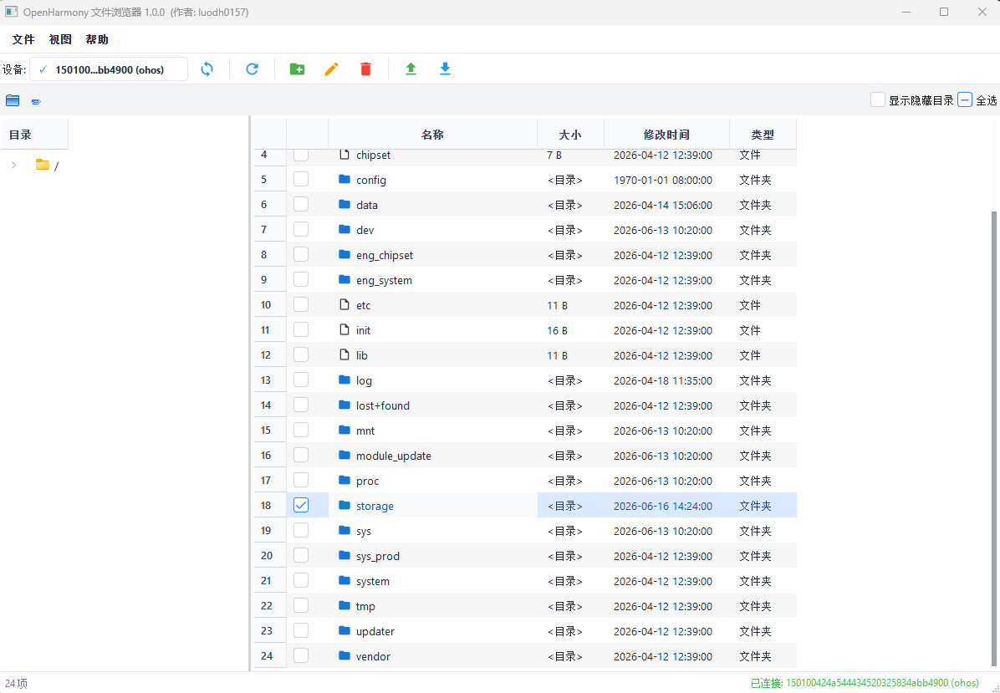

# OpenHarmony File Browser

一个跨平台的 OpenHarmony/HarmonyOS 设备文件管理器，提供图形化界面进行设备连接、文件浏览、传输和预览等操作。

## 功能特性

- **设备管理**：通过 USB 或无线连接 OpenHarmony/HarmonyOS 设备
- **文件浏览**：使用树形和列表视图导航设备文件系统
- **文件操作**：复制、移动、删除、重命名文件和文件夹
- **文件传输**：拖拽上传/下载，支持多任务并发和进度跟踪
- **文件预览**：预览图片和视频
- **主题切换**：支持浅色和深色主题
- **国际化**：支持中文和英文界面
- **跨平台**：支持 Windows、macOS 和 Linux

## 界面预览



## 系统要求

- Python 3.9 或更高版本
- 已启用 USB 调试的 OpenHarmony/HarmonyOS 设备
- HDC（HarmonyOS Device Connector）工具（已内置）

## 安装

### 从源码运行

```bash
# 克隆仓库
git clone https://gitcode.com/OpenHarmony_Tools/OpenHarmony_FileBrowser.git
cd OpenHarmony_FileBrowser

# 创建虚拟环境
python -m venv venv
source venv/bin/activate  # Linux/macOS
# 或
venv\Scripts\activate  # Windows

# 安装依赖
pip install -r requirements.txt

# 运行应用
python main.py
```

### 运行可执行文件

项目已内置各平台的 HDC 工具二进制文件，无需额外配置。

## 使用方法

### 1. 连接设备

- **USB 连接**：通过 USB 连接设备并启用 USB 调试
- **无线连接**：通过 IP 地址和端口连接设备

### 2. 浏览文件

- 使用左侧树形视图导航目录
- 在右侧列表视图中查看文件
- 使用路径栏快速跳转

### 3. 传输文件

- 拖拽文件到设备或从设备拖出
- 使用工具栏上传/下载按钮
- 在传输对话框中监控进度

### 4. 预览文件

- 双击图片进行预览（支持缩放）
- 点击视频播放（调用系统播放器）

### 5. 文件操作

- **新建文件夹**：点击工具栏新建按钮
- **重命名**：选中文件后点击重命名按钮
- **删除**：选中文件后点击删除按钮
- **多选操作**：支持 Ctrl+A 全选、Ctrl+D 取消全选、Ctrl/Shift 多选

### 6. 切换主题和语言

- **主题**：视图菜单或工具栏太阳/月亮图标切换浅色/深色主题
- **语言**：视图菜单切换中文/英文界面

## 开发指南

### 运行测试

```bash
pytest tests/
```

### 代码格式化

```bash
black src/
flake8 src/
```

### 打包可执行文件

```bash
python package/build.py
```

### 项目结构

```
OpenHarmony_FileBrowser/
├── main.py                          # 顶层入口点
├── config/                          # 配置目录
│   ├── config.json                  # 配置文件
│   └── logs/                        # 日志目录
├── .gitignore                       # Git排除规则
├── package/                         # 构建和打包脚本
│   ├── build.py                     # PyInstaller 打包脚本
│   ├── setup.py                     # Python 包安装配置
│   └ README.md                      # 构建说明
├── generate/                        # 图标生成工具
│   ├── generate_icon.py             # 图标生成脚本
│   └ README.md                      # 使用说明
├── requirements.txt                 # 运行时依赖
├── requirements-dev.txt             # 开发依赖
├── LICENSE                          # Apache 2.0 许可证
├── README.md                        # 项目说明文档
├── DESIGN.md                        # 设计文档
│
├── hdc/                             # HDC 工具二进制文件
│   ├── Darwin/                      # macOS 平台
│   ├── Linux/                       # Linux 平台
│   └── Windows/                     # Windows 平台
│
├── src/                             # 源代码根目录
│   ├── main.py                      # 应用主入口点
│   ├── config.py                    # 应用配置
│   │
│   ├── core/                        # 核心业务逻辑
│   │   ├── hdc_wrapper.py           # HDC CLI 封装
│   │   ├── device_manager.py        # 设备连接/监控
│   │   ├── file_operations.py       # 文件 CRUD 操作
│   │   ├── transfer_manager.py      # 文件传输及进度
│   │   └── preview_handler.py       # 图片/视频预览
│   │
│   ├── gui/                         # GUI 组件 (PySide6/Qt)
│   │   ├── main_window.py           # 主应用窗口
│   │   │
│   │   ├── widgets/                 # 可复用 UI 组件
│   │   │   ├── file_browser.py      # 主文件浏览器组件
│   │   │   ├── file_tree.py         # 目录树视图
│   │   │   ├── file_list.py         # 文件列表/表格视图
│   │   │   ├── path_bar.py          # 面包屑导航栏
│   │   │   ├── device_panel.py      # 设备选择器
│   │   │   ├── dialogs.py           # 重命名/创建/删除对话框
│   │   │   ├── transfer_dialog.py   # 传输进度对话框
│   │   │   └── preview_window.py    # 图片/视频预览窗口
│   │   │
│   │   └── styles/                  # 主题和样式
│   │       ├── theme_manager.py     # 浅色/深色主题管理
│   │       └── *.qss                # Qt 样式表
│   │
│   ├── models/                      # 数据模型
│   │   ├── device.py                # DeviceInfo, DeviceStatus
│   │   └── file_info.py             # FileInfo, FileType
│   │
│   ├── utils/                       # 工具模块
│   │   ├── logger.py                # 日志配置
│   │   ├── file_utils.py            # 文件类型检测、格式化
│   │   ├── platform_utils.py        # 平台/架构检测、HDC 路径
│   │   ├── icon_manager.py          # SVG 图标管理，主题感知
│   │   ├── language_manager.py      # 国际化 英文/中文
│   │   └── async_loader.py          # 后台目录加载
│   │
│   └── resources/                   # 静态资源
│       ├── icons/                   # SVG 图标（浅色/深色主题）
│       ├── i18n/                    # 国际化 JSON 文件
│       └── styles/                  # QSS 样式表
│
├── tests/                           # 测试套件
│   ├── unit/                        # 单元测试
│   └ integration/                   # 集成测试
└── package/                         # 构建和打包脚本
```

## 架构设计

项目采用分层 MVC 架构，结合 Qt 的信号/槽机制实现组件间通信：

```
入口层 (main.py)
    ↓
GUI 控制层 (MainWindow)
    ↓
┌───────────┬───────────────┬─────────────┐
│ 设备管理层 │   文件浏览层   │  主题/语言层 │
│ DeviceMgr │ FileBrowser   │ Theme/Lang  │
└───────────┴───────────────┴─────────────┘
    ↓               ↓
┌───────────┬───────────────┐
│ HDC 通信层 │   核心服务层   │
│ HDCWrapper│ FileOps/Trans │
└───────────┴───────────────┘
```

详细架构设计请参考 [DESIGN.md](DESIGN.md)。

## 依赖

### 运行时依赖

| 库 | 版本 | 用途 |
|----|------|------|
| PySide6 | >=6.5.0 | Qt6 Python 绑定 - GUI 框架 |
| Pillow | >=10.0.0 | 图像处理 - 图片预览 |

### 开发依赖

| 库 | 版本 | 用途 |
|----|------|------|
| pytest | >=7.0.0 | 单元测试框架 |
| pytest-qt | >=4.2.0 | Qt 测试夹具 |
| black | >=23.0.0 | 代码格式化 |
| flake8 | >=6.0.0 | 代码检查 |
| pyinstaller | >=6.0.0 | 可执行文件打包 |

## 许可证

Apache License 2.0

## 贡献

欢迎提交 Pull Request 或 Issue！
[OpenHarmony_FileBrowser](https://gitcode.com/OpenHarmony_Tools/OpenHarmony_FileBrowser)

## 支持

如有问题或建议，请在 GitCode 上提交 Issue。
